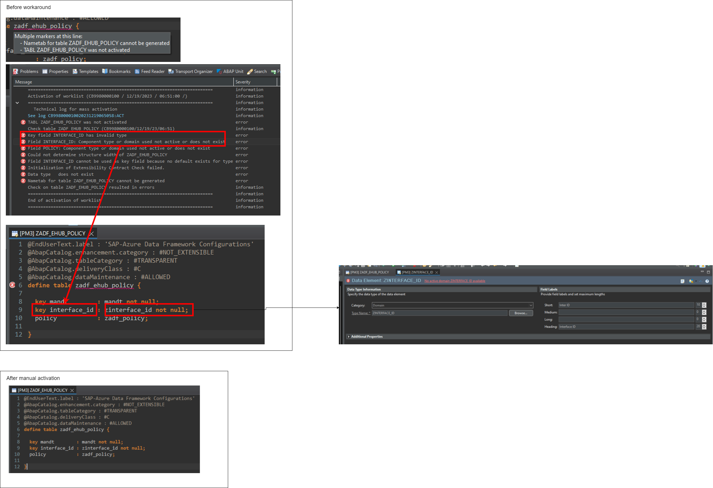
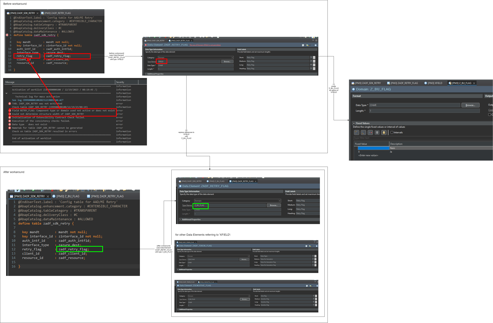
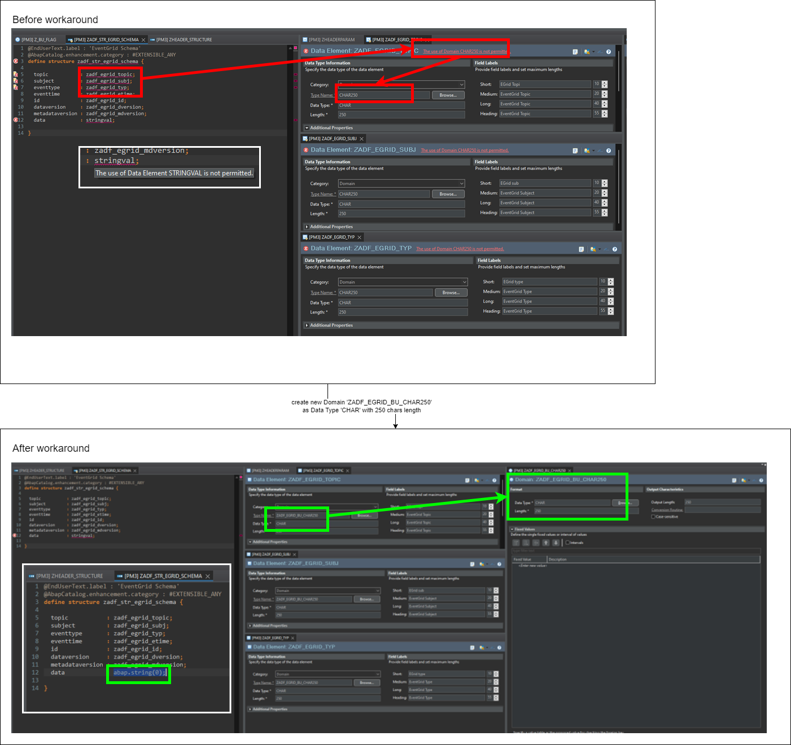
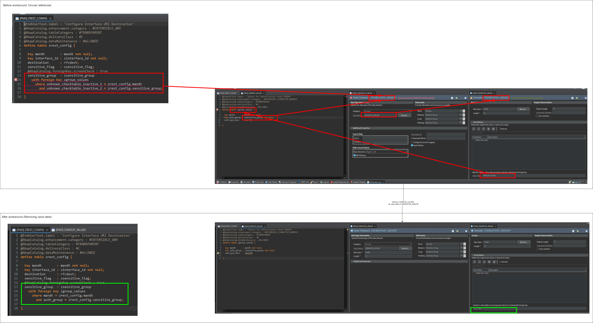

# Enabling ABAP SDK for Azure on BTP ABAP environment.

Due to the differences in the runtime environments of "full-blown" SAP S/4 HANA systems and BTP ABAP environment, it is currently not possible to activate the ABAP SDK for Azure on SAP Cloud's Steampunk environment. So far, we have identified the following challenges:

:point_up: We did not manage to fully activate the SDK for code execution and dynamic testing. All insights are based on static checking done by ADT only.

This doc's purpose is to serve as starting point for everyone in the community to contribute to the ABAP code upgrade to make the ABAP SDK compatible with the classic ABAP world and the new one.

## ADT seems to fail to determine the right activation order.

Observation
- Table `ZADF_EHUB_POLICY` had error markers because `ZINTERFACE_ID` seemed to have an invalid type.
- Domain `ZINTERFACE_ID` had not been activated.
- Domain was individually activated via ADT.
- After that, also Data Element could be activated individually.
- Note: "No active domain" error was showing up until tab was closed in ADT and re-opened.

Conclusion
- It seems that activating elements in the right order could resolve this issue.
- Specific problems / errors do not seem to get refreshed "on the fly" but require a manual refresh of elements by closing and re-opening?

## Use of unpermitted Domains or Data Elements

Lars maintains a list of types [here](https://abaplint.app/stats/microsoft/ABAP-SDK-for-Azure/void_types)

### Use of Domain `XFIELD` is not permitted.

Observation
- Table `ZADF_SDK_RETRY` uses Data Element `ZADF_RETRY_FLAG` for field `retry_flag`.
- This Data Element uses domain `XFIELD` as type.
- However, domain `XFIELD` is not permitted in ABAP Cloud.
- By creating an equivalent definition (`Z_BU_FLAG`) as replacement and pointing Data Element's type to this domain, the error can be mitigated.

### Use of Domain `CHAR250` is not permitted / Use of Data Element `stringval` is not permitted.

Observation
- Structure `ZADF_STR_EGRID_SCHEMA` uses dedicated Data Elements `ZADF_EGRID_TOPIC`, `ZADF_EGRID_SUBJ`, `ZADF_EGRID_TYP` for respective fields.
- All Data Elements use domain `CHAR250` as type.
- However, domain `CHAR250` is not permitted.
- By creating a domain (`ZADF_EGRID_BU_CHAR250`) using Data Type `CHAR` with length `250` and using this as Data Element type, the error could be mitigated.
- Structure `ZADF_STR_EGRID_SCHEMA` also uses Data Element `stringval` which is not permitted.
- The error can be mitigated by replacing it with `abap.string(0)` (as used in other classes such as in `ZADF_SERVICE_GRAPH_USER`)

### Use of Data Element `GUID_16` is not permitted.

Observation
- In interface `ZIF_REST_FRAMEWORK`, field `!MESSAGEID` uses Data Element `GUID16` which is not permitted. 
- The error can be mitigated by replacing it with `SYSUUID_X16`.

### Use of Data Element `SOTR_CONC` is not permitted.

Observation
- Some classes such as `ZCX_ADF_SERVICE`, `ZCX_O365_SERVICE` define constants of type `SOTR_CONC` (overall, VS Code counts 124 definitions within the SDK).
- However, use of Data Element `SOTR_CONC` is not permitted.

### Conclusion
- Quite some types (e.g., Domains `XFIELD` and `CHAR250` or Data Elements `stringval`, `GUID_16` or `SOTR_CONC` are not permitted in Steampunk any more and need replacement.
- This in line with the list of void types published at [abaplint.app - ABAP Static Analysis & Continuous Integration](https://abaplint.app/stats/microsoft/ABAP-SDK-for-Azure/void_types). However, there does not seem to be a consistent guidance about which types to replace where. (Also, type replacements typically propagate through the code.)

# Cycle between `ZSENSITIVE_GROUP` and `ZGROUP_VALUES`

Observation
- Table `ZGROUP_VALUES` uses Data Element `ZSENSITIVE_GROUP` for field  `auth_group`.
- The Data Element uses a Domain named `ZSENSITIVE_GROUP`.
- This domain refers back to table `ZGROUP_VALUES` as `Value Type`, thereby closing a cycle.
- Removing the link to `ZGROUP_VALUES` as `Value Type` resolved the error in table definition `ZGROUP_VALUES`.

Conclusion
- It is unclear, if this implementation pattern makes sense and in which order components can be activated.

## Use of deprecated REST library

Observation
- Following best practices of object-oriented software engineering, all ABAP classes providing a service to interact with Azure services (e.g., `ZCL_ADF_SERVICE_KEYVAULT`) use a common base class, `ZCL_ADF_SERVICE` implementing base functionality.
- This class uses a lot of types that are not permitted to use anymore (see above); such as:
  - `SOTR_CONC` (indirectly via `ZCX_ADF_SERVICE` and `CX_ROOT`)
  - `GUID_16` (via `ZCL_REST_FRAMEWORK` and `ZIF_REST_FRAMEWORK`)

- Furthermore, `ZCL_ADF_SERVICE` (indirectly, via `ZCL_REST_FRAMEWORK`) makes use of legacy ABAP classes and interfaces for HTTP and REST. E.g.:
  - Field `GO_REST_API` uses type `ZCL_REST_FRAMEWORK`. (Overall, VS Code counts a total of 342 occurances of string `go_rest_api` across all code elements of the SDK, showing how deeply this helper class is integrated into the SDK.)
  - Fields `REST_CLIENT` and `HTTP_CLIENT` (in type) `ZCL_REST_FRAMEWORK` use types `CL_REST_HTTP_CLIENT` and `IF_HTTP_CLIENT`.
  - Field `IO_ENTITY` (in interface `ZIF_REST_FRAMEWORK`) uses type `IF_REST_ENTITY` as data structure to interact with HTTP requests and responses. (see [REST HTTP Content Processing](https://help.sap.com/doc/saphelp_nw74/7.4.16/en-US/54/ef29e77608420386a22789aed21884/content.htm?no_cache=true)) (VS Code counts a total of 89 occurances of string `if_rest_entity` and 39 occurances of string `io_entity` across all code elements of the SDK.)
- However, these elements cannot be activated in ABAP Cloud any more (error message `You are not authorized to make changes (authorization object S_ABPLNGVS)`):
  - `IF_REST_ENTITY`
  - `CL_REST_HTTP_CLIENT`
  - `IF_HTTP_CLIENT`

Conclusion
  - Unfortunately, the types of the legacy http / rest classes are used extensively throughout the different service classes. Replacing the HTTP client will also require replacing the respective data classes that are used throughout the entire SDK. 
  - Additionally, Domains and Data Elements whose use is not permitted any more (e.g., `GUID_16` or `stringval`) are used to pass values.

